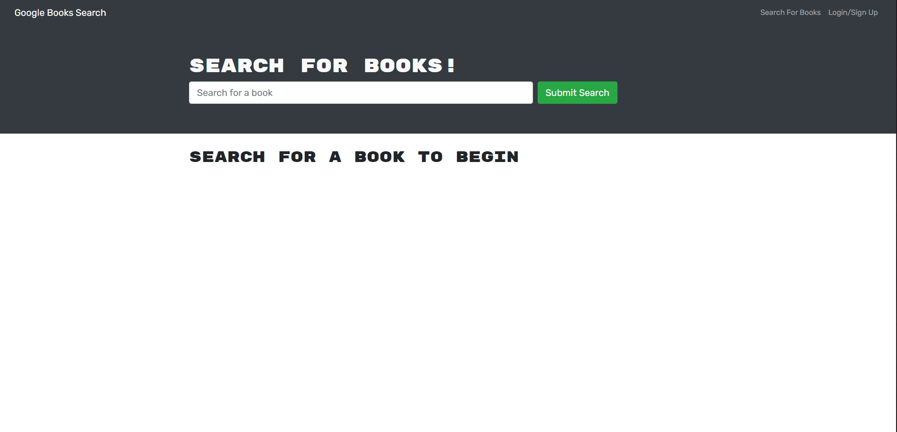

# MERN Book Search Engine
## MERN powered
### Table of Contents
- [Project Discription](#Discription)
- [Useage](#Useage)
- [Installation](#Installation)
- [Contributions](#Constributions)
- [Licence](#Licence)
- [Email](#Questions)
- [github](#Questions)

## Discription
This program when launched creates a server which the user can interact with so the user can find and save their favorite books. 

## Useage 
This program is intended to be used to find and save favorite books

## Installation
To use the app the user must use npm install to install andy dependencies then the user can use the command npm run develop.

## Contributions 
I am the main contributor.

## Licence 

## Questions 
For any further questions that are not addressed in  this README please find my email and github below

### email: jbbalshaw@gmail.com
### github: 

## ScreenShots
